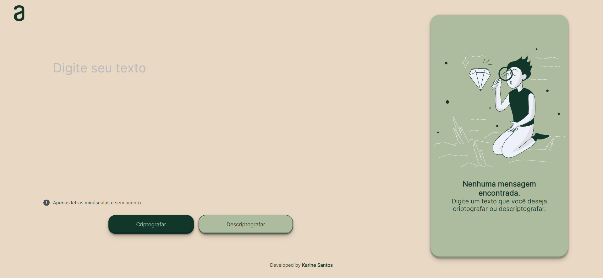

# Text Decoder/Encoder 🔎

This project was built during the first challenge of the Oracle Next Education program, carried out by Oracle in partnership with Alura.

## 🛠️ Technologies
- Javascript;
- HTML;
- CSS.

## ✨ Features
The program allows the user to enter an input message and obtain an output message. He can choose whether to encode or decode a message using the "Encrypt" or "Decrypt" buttons. You can also copy the text of the outgoing message using the "Copy" button.

## 📑 Rules of engagement
- The letter "e" is converted to "enter";
- The letter "i" is converted to "imes";
- The letter "a" is converted to "ai";
- The letter "o" is converted to "ober";
- The letter "u" is converted to "ufat".

### ⚠️ ATTENTION
The system keeps all letters lowercase by default and removes special characters.